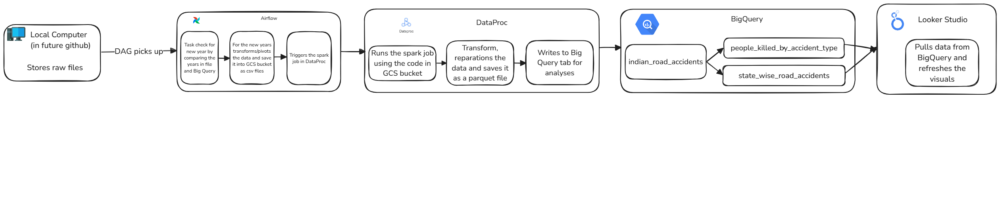

# Indian-Accident-Analysis-Data-Pipeline

## Overview
The Indian Accident Analysis Data Pipeline project aims to analyze road accident data in India using Google Cloud Platform (GCP) services. The project leverages various GCP services such as Google Cloud Storage (GCS), Google BigQuery, Google Dataproc, and Apache Airflow to process and analyze the data. The pipeline is orchestrated using Terraform for infrastructure provisioning, Python Pandas and PySpark for data processing, and Airflow for workflow management.

## Visualization Dashboard
To explore the final output, visit: [Indian Road Accident Analysis](https://lookerstudio.google.com/reporting/6f1ac3ee-a9b4-4be9-b6b2-b12c4cc07f8a)

## Architecture
The architecture of the project is as follows:

1. **Local Storage**: Since the data source has an authentication layer for data download, the data is downloaded and kept in the "data" folder of the root directory. The data is organized by year into two files: state-wise accidents and people killed by accident type.

2. **Apache Airflow**: The Airflow DAG scheduler runs monthly and checks for new data by comparing it with BigQuery. If new data is found, it proceeds further. Python operators transform the data into the required format and upload it to the GCS bucket under `{bucket_name}/raw/{year}/{year}.csv`. It then submits a data processing request to Dataproc.

3. **Google Dataproc**: A managed Spark and Hadoop service used to process the data. Dataproc clusters are created using Terraform, and PySpark jobs are executed on these clusters. The job transforms the data into Parquet files, saves them in the same bucket under `{bucket_name}/parquet/{year}/`, and writes the data to Google BigQuery for further analysis.

4. **Google Cloud Storage (GCS)**: Used to store transformed and Parquet data. The data is organized by year and type (state-wise accidents and people killed by accident type).

5. **Google BigQuery**: Processed data is stored in BigQuery tables for further analysis and visualization.

6. **Terraform**: Infrastructure as Code (IaC) tool used to provision and manage GCP resources such as GCS buckets, Dataproc clusters, and BigQuery datasets.

7. **Google Looker Studio**: Used to create the visualization dashboard.

### Architecture Diagram


## Project Structure
The project structure is as follows:
- `data/`: Raw data is stored here.
- `keys/creds.json`: GCP service account authentication file.
- `airflow/dags/people_killed_by_accidents_dag.py`: Airflow DAG to process people killed by accident type data.
- `airflow/dags/state_accidents_dag.py`: Airflow DAG to process state-wise accident data.
- `experiment/big-query-spark.py`: PySpark script to process and load data into BigQuery.
- `terraform/main.tf`: Terraform configuration file to provision GCP resources.
- `terraform/variables.tf`: Terraform variables file.
- `README.md`: Project documentation.

## Important Files Location
```
Indian-Accident-Analysis-Data-Pipeline/
├── airflow/
│   ├── dags/
│   │   ├── indian_accident_analysis_dag.py
│   │   ├── people_killed_by_accidents_dag.py
│   │   ├── state_accidents_dag.py
├── data/
│   ├── deaths-by-accident-type.csv
│   ├── state-wise-accidents.csv
├── experiment/
│   ├── big-query-spark.py
├── terraform/
│   ├── main.tf
│   ├── variables.tf
│   ├── terraform.tfvars
├── README.md
```

## Setup and Deployment

### Prerequisites
- Google Cloud Platform account
- Terraform installed
- Google Cloud SDK installed
- Python installed
- PySpark installed
- Docker and Docker Compose installed

### Steps

1. **Clone the repository**:
    ```sh
    git clone https://github.com/your-repo/Indian-Accident-Analysis-Data-Pipeline.git
    cd Indian-Accident-Analysis-Data-Pipeline
    ```

2. **Configure Terraform**:
    - Update `terraform/variables.tf` with your GCP project details and other required variables.

3. **Initialize and apply Terraform**:
    ```sh
    cd terraform
    terraform init
    terraform apply
    ```

4. **Start Airflow**:
    - Navigate to the `/airflow` folder and run:
    ```sh
    docker compose up -d
    ```
    - Visit `http://localhost:8080` and log in with "airflow" as the username and password. Verify that Airflow is running and DAGs are visible.

5. **Upload the Spark code to the GCS bucket**:
    - Manually upload the code or use the following command:
    ```sh
    cd experiment/
    
    gsutil cp big-query-spark.py gs://<bucket_name>/code/big-query-spark.py
    ```

6. **Update the Dataproc endpoint in the Airflow DAG**:
    - Update the configuration section in both Airflow DAGs with the correct Dataproc endpoint.

7. **Run DAG**:
    - Trigger the DAG to process the data and observe the changes in real-time.

8. **Visualization**:
    - Connect your BI tool of choice (e.g., Looker Studio) to the BigQuery datasets and create the required visuals.

## Data Processing
The PySpark script `big-query-spark.py` processes the data as follows:

1. Reads raw data from GCS.
2. Applies necessary transformations and cleaning.
3. Writes the processed data back to GCS in Parquet format.
4. Loads the processed data into BigQuery tables.

## BigQuery Tables
- `state_wise_road_accidents`: Contains state-wise road accident data.
- `people_killed_by_accident_type`: Contains data on people killed by different types of accidents.

## Airflow DAGs
### people_killed_by_accidents_dag.py
This DAG processes the people killed by accident type data:
1. Checks for missing years.
2. Transforms the data for missing years.
3. Uploads the transformed data to GCS.

### state_accidents_dag.py
This DAG processes the state-wise accident data:
1. Checks for missing years.
2. Transforms the data for missing years.
3. Uploads the transformed data to GCS.

## Troubleshooting
- **Airflow DAGs not visible**: Ensure the DAG files are in the correct directory and Airflow is restarted.
- **Terraform errors**: Verify the `variables.tf` file and ensure all required variables are set correctly.
- **Data not loading into BigQuery**: Check the logs of the PySpark job for errors.

## Contributing
Contributions are welcome! Please open an issue or submit a pull request for any improvements or bug fixes.

## License
This project is licensed under the MIT License.

